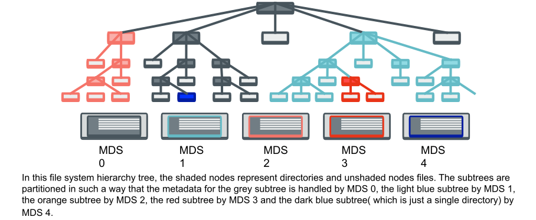

# CephFS Dynamic Metadata Management

Metadata operations usually take up more than 50 percent of all file
system operations. Also the metadata scales in a more complex fashion
when compared to scaling storage (which in turn scales I/O throughput
linearly). This is due to the hierarchical and interdependent nature of
the file system metadata. So in CephFS, the metadata workload is
decoupled from data workload so as to avoid placing unnecessary strain
on the RADOS cluster. The metadata is hence handled by a cluster of
Metadata Servers (MDSs). CephFS distributes metadata across MDSs via
[Dynamic Subtree
Partitioning](https://ceph.com/assets/pdfs/weil-mds-sc04.pdf).

## Dynamic Subtree Partitioning

In traditional subtree partitioning, subtrees of the file system
hierarchy are assigned to individual MDSs. This metadata distribution
strategy provides good hierarchical locality, linear growth of cache and
horizontal scaling across MDSs and a fairly good distribution of
metadata across MDSs.

The problem with traditional subtree partitioning is that the workload
growth by depth (across a single MDS) leads to a hotspot of activity.
This results in lack of vertical scaling and wastage of non-busy
resources/MDSs.

This led to the adoption of a more dynamic way of handling metadata:
Dynamic Subtree Partitioning, where load intensive portions of the
directory hierarchy from busy MDSs are migrated to non busy MDSs.

This strategy ensures that activity hotspots are relieved as they appear
and so leads to vertical scaling of the metadata workload in addition to
horizontal scaling.

## Export Process During Subtree Migration

Once the exporter verifies that the subtree is permissible to be
exported (Non degraded cluster, non-frozen subtree root), the subtree
root directory is temporarily auth pinned, the subtree freeze is
initiated, and the exporter is committed to the subtree migration,
barring an intervening failure of the importer or itself.

The MExportDiscover message is exchanged to ensure that the inode for
the base directory being exported is open on the destination node. It is
auth pinned by the importer to prevent it from being trimmed. This
occurs before the exporter completes the freeze of the subtree to ensure
that the importer is able to replicate the necessary metadata. When the
exporter receives the MDiscoverAck, it allows the freeze to proceed by
removing its temporary auth pin.

A warning stage occurs only if the base subtree directory is open by
nodes other than the importer and exporter. If it is not, then this
implies that no metadata within or nested beneath the subtree is
replicated by any node other than the importer and exporter. If it is,
then an MExportWarning message informs any bystanders that the authority
for the region is temporarily ambiguous, and lists both the exporter and
importer as authoritative MDS nodes. In particular, bystanders who are
trimming items from their cache must send MCacheExpire messages to both
the old and new authorities. This is necessary to ensure that the
surviving authority reliably receives all expirations even if the
importer or exporter fails. While the subtree is frozen (on both the
importer and exporter), expirations will not be immediately processed;
instead, they will be queued until the region is unfrozen and it can be
determined that the node is or is not authoritative.

The exporter then packages an MExport message containing all metadata of
the subtree and flags the objects as non-authoritative. The MExport
message sends the actual subtree metadata to the importer. Upon receipt,
the importer inserts the data into its cache, marks all objects as
authoritative, and logs a copy of all metadata in an EImportStart
journal message. Once that has safely flushed, it replies with an
MExportAck. The exporter can now log an EExport journal entry, which
ultimately specifies that the export was a success. In the presence of
failures, it is the existence of the EExport entry only that
disambiguates authority during recovery.

Once logged, the exporter will send an MExportNotify to any bystanders,
informing them that the authority is no longer ambiguous and cache
expirations should be sent only to the new authority (the importer).
Once these are acknowledged back to the exporter, implicitly flushing
the bystander to exporter message streams of any stray expiration
notices, the exporter unfreezes the subtree, cleans up its
migration-related state, and sends a final MExportFinish to the
importer. Upon receipt, the importer logs an EImportFinish(true) (noting
locally that the export was indeed a success), unfreezes its subtree,
processes any queued cache expirations, and cleans up its state.
