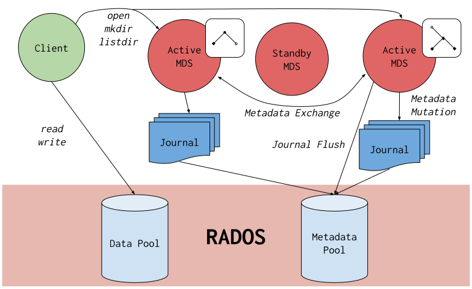

# Ceph File System

The Ceph File System, or **CephFS**, is a POSIX-compliant file system
built on top of Ceph\'s distributed object store, **RADOS**. CephFS
endeavors to provide a state-of-the-art, multi-use, highly available,
and performant file store for a variety of applications, including
traditional use-cases like shared home directories, HPC scratch space,
and distributed workflow shared storage.

CephFS achieves these goals through novel architectural choices.
Notably, file metadata is stored in a RADOS pool separate from file data
and is served via a resizable cluster of *Metadata Servers*, or
**MDS**es, which scale to support higher-throughput workloads. Clients
of the file system have direct access to RADOS for reading and writing
file data blocks. This makes it possible for workloads to scale linearly
with the size of the underlying RADOS object store. There is no gateway
or broker that mediates data I/O for clients.

Access to data is coordinated through the cluster of MDS which serve as
authorities for the state of the distributed metadata cache
cooperatively maintained by clients and MDS. Mutations to metadata are
aggregated by each MDS into a series of efficient writes to a journal on
RADOS; no metadata state is stored locally by the MDS. This model allows
for coherent and rapid collaboration between clients within the context
of a POSIX file system.

CephFS is the subject of numerous academic papers for its novel designs
and contributions to file system research. It is the oldest storage
interface in Ceph and was once the primary use-case for RADOS. Now it is
joined by two other storage interfaces to form a modern unified storage
system: RBD (Ceph Block Devices) and RGW (Ceph Object Storage Gateway).

## Getting Started with CephFS

For most deployments of Ceph, setting up your first CephFS file system
is as simple as:

::: prompt
bash

\# Create a CephFS volume named (for example) \"cephfs\": ceph fs volume
create cephfs
:::

The Ceph [Orchestrator](../mgr/orchestrator) will automatically create
and configure MDS for your file system if the back-end deployment
technology supports it (see [Orchestrator deployment
table](../mgr/orchestrator/#current-implementation-status)). Otherwise,
please [deploy MDS manually as needed](add-remove-mds). You can also
[create other CephFS volumes](fs-volumes).

Finally, to mount CephFS on your client nodes, see [Mount CephFS:
Prerequisites](mount-prerequisites) page. Additionally, a command-line
shell utility is available for interactive access or scripting via the
[cephfs-shell](../man/8/cephfs-shell).

<!---

## Administration

--->

::: {.toctree maxdepth="1" hidden=""}
Create a CephFS file system \<createfs\> Administrative commands
\<administration\> Creating Multiple File Systems \<multifs\>
Provision/Add/Remove MDS(s) \<add-remove-mds\> MDS failover and standby
configuration \<standby\> MDS Cache Configuration
\<cache-configuration\> MDS Configuration Settings \<mds-config-ref\>
Manual: ceph-mds \<../../man/8/ceph-mds\> Export over NFS \<nfs\>
Application best practices \<app-best-practices\> FS volume and
subvolumes \<fs-volumes\> CephFS Quotas \<quota\> Health messages
\<health-messages\> Upgrading old file systems \<upgrading\> CephFS Top
Utility \<cephfs-top\> Scheduled Snapshots \<snap-schedule\> CephFS
Snapshot Mirroring \<cephfs-mirroring\>
:::

<!---

## Mounting CephFS

--->

::: {.toctree maxdepth="1" hidden=""}
Client Configuration Settings \<client-config-ref\> Client
Authentication \<client-auth\> Mount CephFS: Prerequisites
\<mount-prerequisites\> Mount CephFS using Kernel Driver
\<mount-using-kernel-driver\> Mount CephFS using FUSE
\<mount-using-fuse\> Mount CephFS on Windows \<ceph-dokan\> Use the
CephFS Shell \<../../man/8/cephfs-shell\> Supported Features of Kernel
Driver \<kernel-features\> Manual: ceph-fuse \<../../man/8/ceph-fuse\>
Manual: mount.ceph \<../../man/8/mount.ceph\> Manual: mount.fuse.ceph
\<../../man/8/mount.fuse.ceph\>
:::

<!---

## CephFS Concepts

--->

::: {.toctree maxdepth="1" hidden=""}
MDS States \<mds-states\> POSIX compatibility \<posix\> MDS Journaling
\<mds-journaling\> File layouts \<file-layouts\> Distributed Metadata
Cache \<mdcache\> Dynamic Metadata Management in CephFS
\<dynamic-metadata-management\> CephFS IO Path \<cephfs-io-path\> LazyIO
\<lazyio\> Directory fragmentation \<dirfrags\> Multiple active MDS
daemons \<multimds\>
:::

<!---

## Troubleshooting and Disaster Recovery

--->

::: {.toctree hidden=""}
Client eviction \<eviction\> Scrubbing the File System \<scrub\>
Handling full file systems \<full\> Metadata repair
\<disaster-recovery-experts\> Troubleshooting \<troubleshooting\>
Disaster recovery \<disaster-recovery\> cephfs-journal-tool
\<cephfs-journal-tool\> Recovering file system after monitor store loss
\<recover-fs-after-mon-store-loss\>
:::

<!---

## Developer Guides

--->

::: {.toctree maxdepth="1" hidden=""}
Journaler Configuration \<journaler\> Client\'s Capabilities
\<capabilities\> Java and Python bindings \<api/index\> Mantle
\<mantle\> Metrics \<metrics\>
:::

<!---

## Additional Details

--->

::: {.toctree maxdepth="1" hidden=""}
Experimental Features \<experimental-features\>
:::
