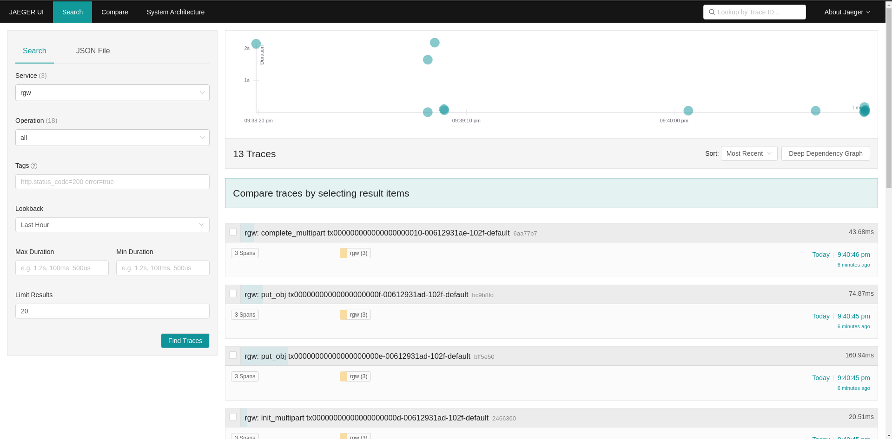
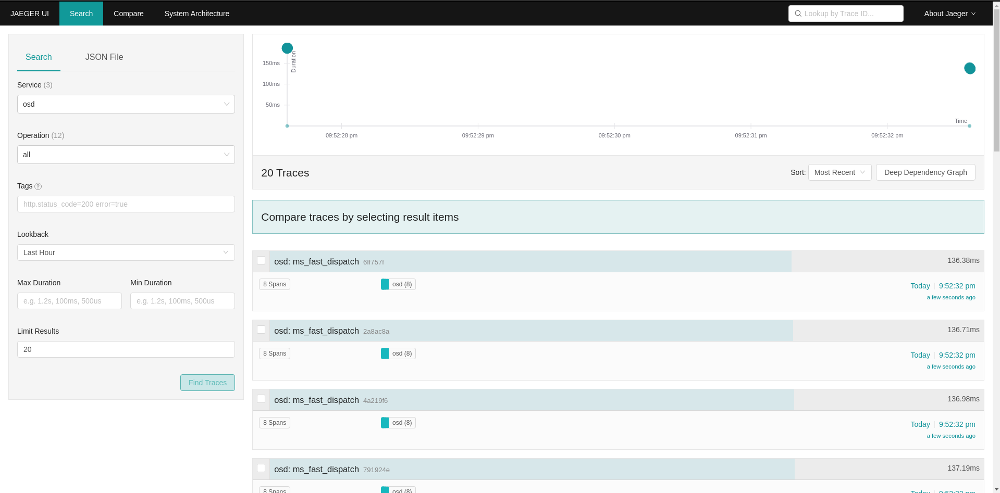

# JAEGER- DISTRIBUTED TRACING

Jaeger provides ready-to-use tracing services for distributed systems.

## BASIC ARCHITECTURE AND TERMINOLOGY

-   TRACE: A trace shows the data/execution path through a system.
-   SPAN: A single unit of a trace. A data structure that stores
    information such as the operation name, timestamps, and the ordering
    within a trace.
-   JAEGER CLIENT: Language-specific implementations of the OpenTracing
    API.
-   JAEGER AGENT: A daemon that listens for spans sent over User
    Datagram Protocol. The agent is meant to be placed on the same host
    as the instrumented application. (The Jaeger agent acts like a
    sidecar listener.)
-   JAEGER COLLECTOR: A daemon that receives spans sent by the Jaeger
    agent. The Jaeger collector then stitches the spans together to form
    a trace. (A databse can be enabled to persist a database for these
    traces).
-   JAEGER QUERY AND CONSOLE FRONTEND: The UI-based frontend that
    presents reports of the jaeger traces. Accessible at
    <http://>\<jaeger frontend host\>:16686.

Read more about jaeger tracing:.

> <https://www.jaegertracing.io/docs/>

## JAEGER DEPLOYMENT

Jaeger can be deployed using cephadm, or manually.

## CEPHADM BASED DEPLOYMENT AS A SERVICE

[Cephadm Jaeger Services Deployment](../cephadm/services/tracing/)

## MANUAL TEST DEPLOYMENT FOR JAEGER OPENTELEMETRY ALL IN ONE CONTAINER

For single node testing Jaeger opentelemetry can be deployed using:

::: prompt
bash \$

docker run -d \--name jaeger -e COLLECTOR_ZIPKIN_HOST_PORT=:9411 -e
COLLECTOR_OTLP_ENABLED=true -p 6799:6799/udp -p 6832:6832/udp -p
5778:5778 -p 16686:16686 -p 4317:4317 -p 4318:4318 -p 14250:14250 -p
14268:14268 -p 14269:14269 -p 9411:9411 jaegertracing/all-in-one:latest
\--processor.jaeger-compact.server-host-port=6799
:::

[Jaeger Deployment](https://www.jaegertracing.io/docs/1.25/deployment/)

[Jaeger Performance
Tuning](https://www.jaegertracing.io/docs/1.25/performance-tuning/)

:::: note
::: title
Note
:::

The Jaeger agent must be running on each host (and not running in
all-in-one mode). This is because spans are sent to the local Jaeger
agent. Spans of hosts that do not have active Jaeger agents will be
lost.

The default configured port for Jaeger agent differs from the official
default 6831, since Ceph tracers are configured to send tracers to
agents that listen to port the configured 6799. Use the option
\"\--processor.jaeger-compact.server-host-port=6799\" for manual Jaeger
deployments.
::::

## HOW TO ENABLE TRACING IN CEPH

Tracing in Ceph is disabled by default.

Tracing can be enabled globally, and tracing can also be enabled
separately for each entity (for example, for rgw).

Enable tracing globally:

::: prompt
bash \$

ceph config set global jaeger_tracing_enable true
:::

Enable tracing for each entity:

::: prompt
bash \$

ceph config set \<entity\> jaeger_tracing_enable true
:::

## TRACES IN RGW

Traces run on RGW can be found under the Service [rgw]{.title-ref} in
the Jaeger Frontend.

### REQUESTS

Every user request is traced. Each trace contains tags for [Operation
name]{.title-ref}, [User id]{.title-ref}, [Object name]{.title-ref} and
[Bucket name]{.title-ref}.

There is also an [Upload id]{.title-ref} tag for Multipart upload
operations.

The names of request traces have the following format: [\<command\>
\<transaction id\>]{.title-ref}.

### MULTIPART UPLOAD

There is a kind of trace that consists of a span for each request made
by a multipart upload, and it includes all [Put Object]{.title-ref}
requests.

The names of multipart traces have the following format:
[multipart_upload \<upload id\>]{.title-ref}.

rgw service in Jaeger Frontend:

{width="400px"}

osd service in Jaeger Frontend:

{width="400px"}
