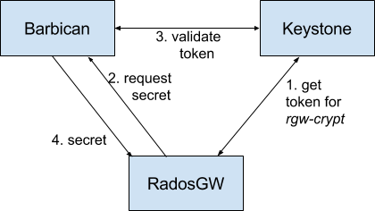

# OpenStack Barbican Integration

OpenStack [Barbican](https://wiki.openstack.org/wiki/Barbican) can be
used as a secure key management service for [Server-Side
Encryption](../encryption).

1.  [Configure Keystone](#configure-keystone)
2.  [Create a Keystone user](#create-a-keystone-user)
3.  [Configure the Ceph Object
    Gateway](#configure-the-ceph-object-gateway)
4.  [Create a key in Barbican](#create-a-key-in-barbican)

## Configure Keystone

Barbican depends on Keystone for authorization and access control of its
keys.

See [OpenStack Keystone Integration](../keystone).

## Create a Keystone user

Create a new user that will be used by the Ceph Object Gateway to
retrieve keys.

For example:

    user = rgwcrypt-user
    pass = rgwcrypt-password
    tenant = rgwcrypt

See OpenStack documentation for [Manage projects, users, and
roles](https://docs.openstack.org/admin-guide/cli-manage-projects-users-and-roles.html#create-a-user).

## Create a key in Barbican

See Barbican documentation for [How to Create a
Secret](https://developer.openstack.org/api-guide/key-manager/secrets.html#how-to-create-a-secret).
Requests to Barbican must include a valid Keystone token in the
`X-Auth-Token` header.

:::: note
::: title
Note
:::

Server-side encryption keys must be 256-bit long and base64 encoded.
::::

Example request:

    POST /v1/secrets HTTP/1.1
    Host: barbican.example.com:9311
    Accept: */*
    Content-Type: application/json
    X-Auth-Token: 7f7d588dd29b44df983bc961a6b73a10
    Content-Length: 299

    {
        "name": "my-key",
        "expiration": "2016-12-28T19:14:44.180394",
        "algorithm": "aes",
        "bit_length": 256,
        "mode": "cbc",
        "payload": "6b+WOZ1T3cqZMxgThRcXAQBrS5mXKdDUphvpxptl9/4=",
        "payload_content_type": "application/octet-stream",
        "payload_content_encoding": "base64"
    }

Response:

    {"secret_ref": "http://barbican.example.com:9311/v1/secrets/d1e7ef3b-f841-4b7c-90b2-b7d90ca2d723"}

In the response, `d1e7ef3b-f841-4b7c-90b2-b7d90ca2d723` is the key id
that can be used in any
[SSE-KMS](http://docs.aws.amazon.com/AmazonS3/latest/dev/UsingKMSEncryption.html)
request.

This newly created key is not accessible by user `rgwcrypt-user`. This
privilege must be added with an ACL. See [How to Set/Replace
ACL](https://developer.openstack.org/api-guide/key-manager/acls.html#how-to-set-replace-acl)
for more details.

Example request (assuming that the Keystone id of `rgwcrypt-user` is
`906aa90bd8a946c89cdff80d0869460f`):

    PUT /v1/secrets/d1e7ef3b-f841-4b7c-90b2-b7d90ca2d723/acl HTTP/1.1
    Host: barbican.example.com:9311
    Accept: */*
    Content-Type: application/json
    X-Auth-Token: 7f7d588dd29b44df983bc961a6b73a10
    Content-Length: 101

    {
        "read":{
        "users":[ "906aa90bd8a946c89cdff80d0869460f" ],
        "project-access": true
        }
    }

Response:

    {"acl_ref": "http://barbican.example.com:9311/v1/secrets/d1e7ef3b-f841-4b7c-90b2-b7d90ca2d723/acl"}

## Configure the Ceph Object Gateway

Edit the Ceph configuration file to enable Barbican as a KMS and add
information about the Barbican server and Keystone user:

    rgw crypt s3 kms backend = barbican
    rgw barbican url = http://barbican.example.com:9311
    rgw keystone barbican user = rgwcrypt-user
    rgw keystone barbican password = rgwcrypt-password

When using Keystone API version 2:

    rgw keystone barbican tenant = rgwcrypt

When using API version 3:

    rgw keystone barbican project
    rgw keystone barbican domain
