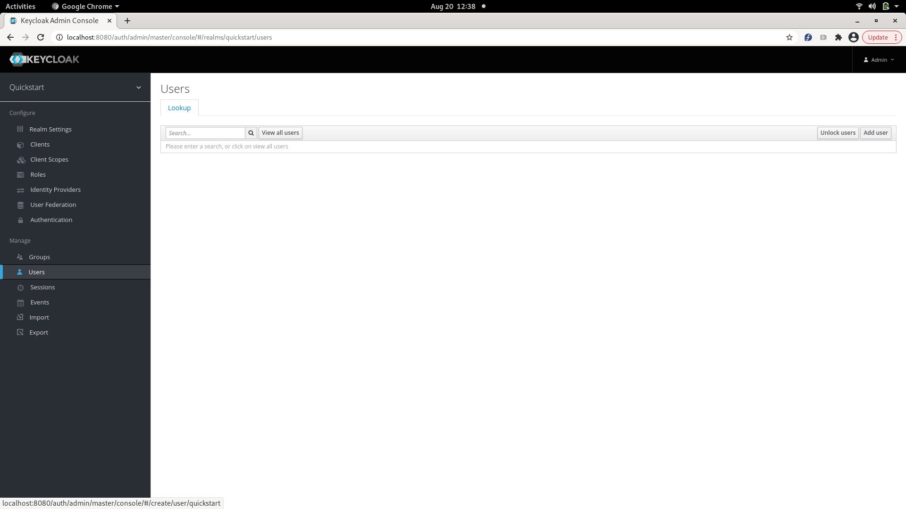
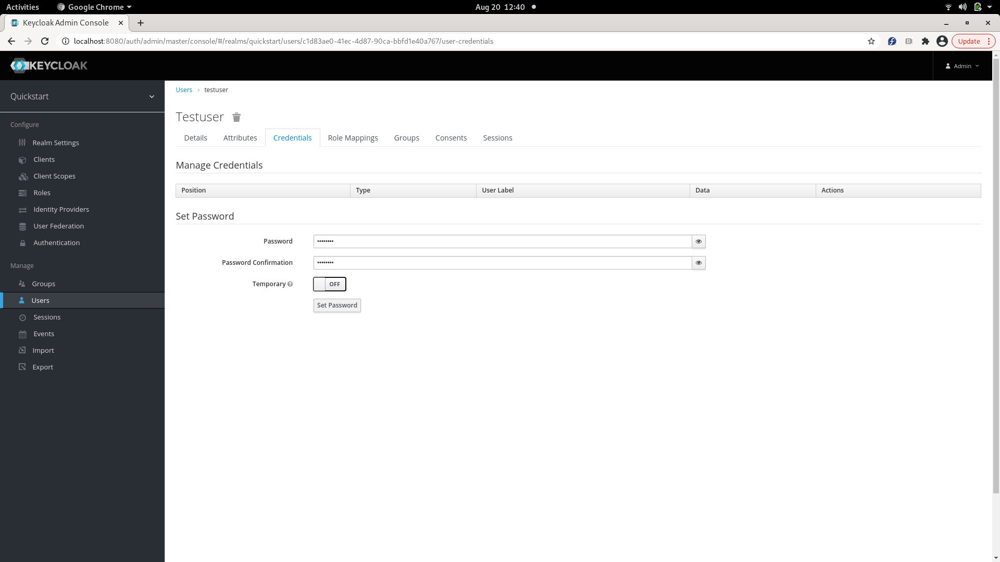
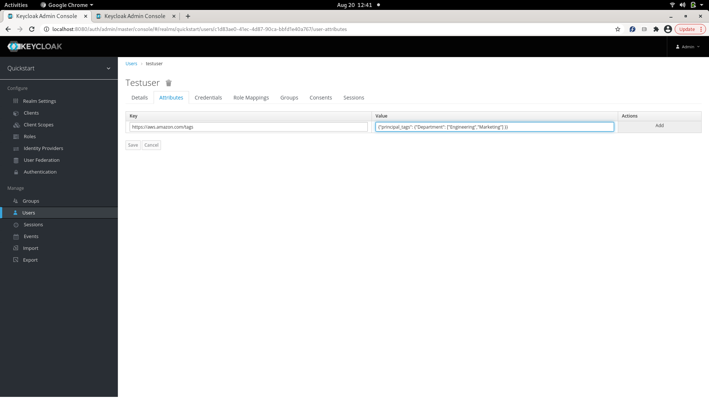
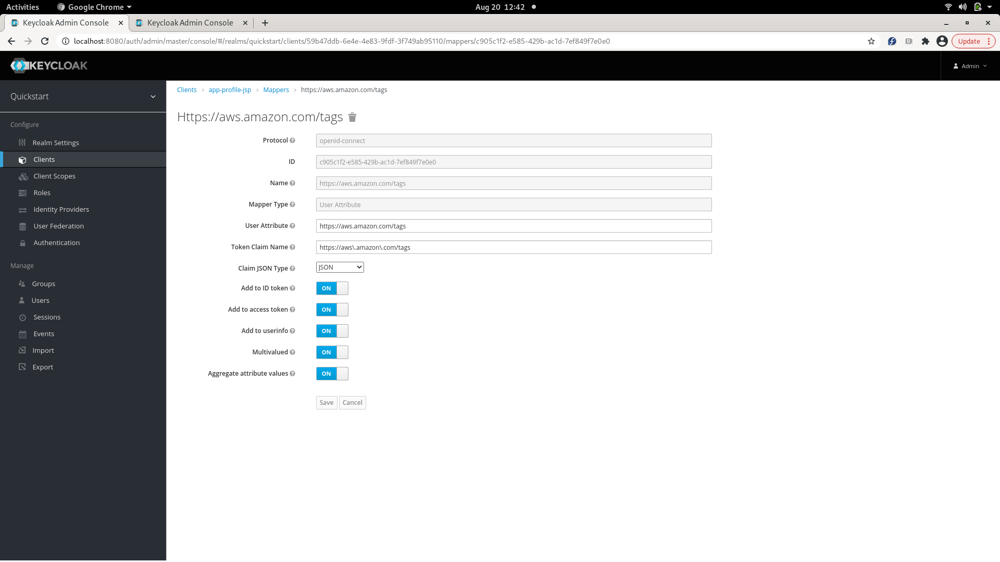

# Integrating Keycloak with RadosGW {#radosgw_keycloak}

If Keycloak is set up as an OpenID Connect Identity Provider, it can be
used by mobile apps and web apps to authenticate their users. By using
the web token returned by the authentication process, a mobile app or
web app can call AssumeRoleWithWebIdentity, receive a set of temporary
S3 credentials, and use those credentials to make S3 calls.

## Setting up Keycloak

Documentation for installing and operating Keycloak can be found here:
<https://www.keycloak.org/guides>.

## Configuring Keycloak to talk to RGW

To configure Keycloak to talk to RGW, add the following configurables:

    [client.radosgw.gateway]
    rgw sts key = {sts key for encrypting/ decrypting the session token}
    rgw s3 auth use sts = true

## Fetching a web token with Keycloak

Several examples of apps authenticating with Keycloak can be found here:
<https://github.com/keycloak/keycloak-quickstarts/blob/latest/docs/getting-started.md>.

Here you might consider the example of the app-profile-jee-jsp app (in
the link above). To fetch the access token (web token) for such an
application using the grant type \'client_credentials\', one can use
client id and client secret as follows:

    KC_REALM=demo
    KC_CLIENT=<client id>
    KC_CLIENT_SECRET=<client secret>
    KC_SERVER=<host>:8080
    KC_CONTEXT=auth

    # Request Tokens for credentials
    KC_RESPONSE=$( \
    curl -k -v -X POST \
    -H "Content-Type: application/x-www-form-urlencoded" \
    -d "scope=openid" \
    -d "grant_type=client_credentials" \
    -d "client_id=$KC_CLIENT" \
    -d "client_secret=$KC_CLIENT_SECRET" \
    "http://$KC_SERVER/$KC_CONTEXT/realms/$KC_REALM/protocol/openid-connect/token" \
    | jq .
    )

    KC_ACCESS_TOKEN=$(echo $KC_RESPONSE| jq -r .access_token)

It is also possible to fetch an access token for a particular user with
the grant type \'password\'. To fetch such an access token, use client
id, client secret, username, and password as follows:

    KC_REALM=demo
    KC_USERNAME=<username>
    KC_PASSWORD=<userpassword>
    KC_CLIENT=<client id>
    KC_CLIENT_SECRET=<client secret>
    KC_SERVER=<host>:8080
    KC_CONTEXT=auth

    # Request Tokens for credentials
    KC_RESPONSE=$( \
    curl -k -v -X POST \
    -H "Content-Type: application/x-www-form-urlencoded" \
    -d "scope=openid" \
    -d "grant_type=password" \
    -d "client_id=$KC_CLIENT" \
    -d "client_secret=$KC_CLIENT_SECRET" \
    -d "username=$KC_USERNAME" \
    -d "password=$KC_PASSWORD" \
    "http://$KC_SERVER/$KC_CONTEXT/realms/$KC_REALM/protocol/openid-connect/token" \
    | jq .
    )

    KC_ACCESS_TOKEN=$(echo $KC_RESPONSE| jq -r .access_token)

`KC_ACCESS_TOKEN` can be used to invoke `AssumeRoleWithWebIdentity`: see
`STS`{.interpreted-text role="doc"}.

## Adding tags to a user in Keycloak

To create a user in Keycloak and add tags to it as its attributes,
follow these steps:

1.  Add a user:

    {.align-center}

2.  Add user details:

    {.align-center}

3.  Add user credentials:

    {.align-center}

4.  Add tags to the \'attributes\' tab of the user:

    {.align-center}

5.  Add a protocol mapper that maps the user attribute to a client:

    {.align-center}

After these steps have been completed, the tag \'Department\' will
appear in the JWT (web token), under the
\'<https://aws.amazon.com/tags>\' namespace.

Tags can be verified by performing token introspection on a JWT. To
introspect a token, use `client id` and `client secret` as follows:

    KC_REALM=demo
    KC_CLIENT=<client id>
    KC_CLIENT_SECRET=<client secret>
    KC_SERVER=<host>:8080
    KC_CONTEXT=auth

    curl -k -v \
    -X POST \
    -u "$KC_CLIENT:$KC_CLIENT_SECRET" \
    -d "token=$KC_ACCESS_TOKEN" \
    "http://$KC_SERVER/$KC_CONTEXT/realms/$KC_REALM/protocol/openid-connect/token/introspect" \
    | jq .
