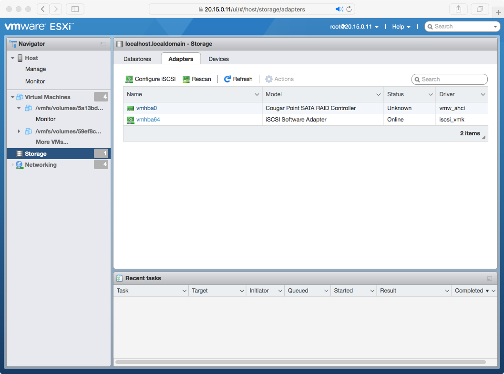
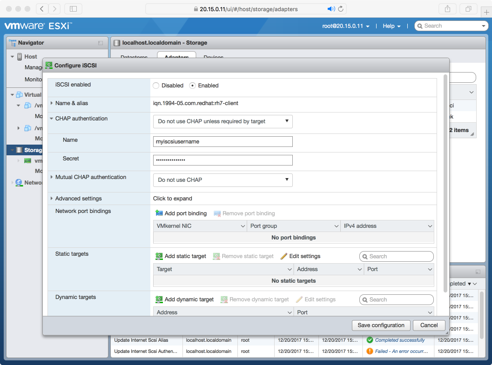
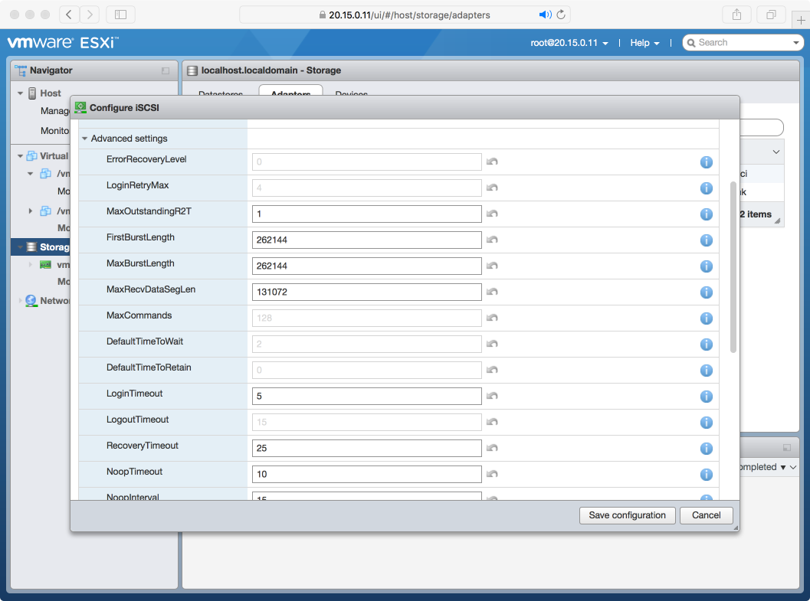

# iSCSI Initiator for VMware ESX

**Prerequisite:**

-   VMware ESX 6.5 or later using Virtual Machine compatibility 6.5 with
    VMFS 6.

**iSCSI Discovery and Multipath Device Setup:**

The following instructions will use the default vSphere web client and
esxcli.

1.  Enable Software iSCSI

    {.align-center}

    Click on \"Storage\" from \"Navigator\", and select the \"Adapters\"
    tab. From there right click \"Configure iSCSI\".

2.  Set Initiator Name

    {.align-center}

    If the initiator name in the \"Name & alias\" section is not the
    same name used when creating the client during gwcli setup or the
    initiator name used in the ansible client_connections client
    variable, then ssh to the ESX host and run the following esxcli
    commands to change the name.

    Get the adapter name for Software iSCSI:

        > esxcli iscsi adapter list
        > Adapter  Driver     State   UID            Description
        > -------  ---------  ------  -------------  ----------------------
        > vmhba64  iscsi_vmk  online  iscsi.vmhba64  iSCSI Software Adapter

    In this example the software iSCSI adapter is vmhba64 and the
    initiator name is iqn.1994-05.com.redhat:rh7-client:

    > > esxcli iscsi adapter set -A vmhba64 -n iqn.1994-05.com.redhat:rh7-client

3.  Setup CHAP

    {.align-center}

    Expand the CHAP authentication section, select \"Do not use CHAP
    unless required by target\" and enter the CHAP credentials used in
    the gwcli auth command or ansible client_connections credentials
    variable.

    The Mutual CHAP authentication section should have \"Do not use
    CHAP\" selected.

    Warning: There is a bug in the web client where the requested CHAP
    settings are not always used initially. On the iSCSI gateway kernel
    logs you will see the error:

    > > kernel: CHAP user or password not set for Initiator ACL
    >     > kernel: Security negotiation failed.
    >     > kernel: iSCSI Login negotiation failed.

    To workaround this set the CHAP settings with the esxcli command.
    Here authname is the username and secret is the password used in
    previous examples:

        > esxcli iscsi adapter auth chap set --direction=uni --authname=myiscsiusername --secret=myiscsipassword --level=discouraged -A vmhba64

4.  Configure iSCSI Settings

    {.align-center}

    Expand Advanced settings and set the \"RecoveryTimeout\" to 25.

5.  Set the discovery address

    {.align-center}

    In the Dynamic targets section, click \"Add dynamic target\" and
    under Addresses add one of the gateway IP addresses added during the
    iSCSI gateway setup stage in the gwcli section or an IP set in the
    ansible gateway_ip_list variable. Only one address needs to be added
    as the gateways have been setup so all the iSCSI portals are
    returned during discovery.

    Finally, click the \"Save configuration\" button. In the Devices
    tab, you should see the RBD image.

    The LUN should be automatically configured and using the ALUA SATP
    and MRU PSP. Other SATPs and PSPs must not be used. This can be
    verified with the esxcli command:

        > esxcli storage nmp path list -d eui.your_devices_id
